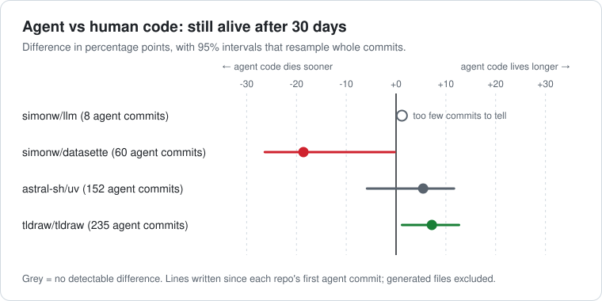

<h1 align="center">shelf-life</h1>

<p align="center">
  <em>How long does your agent's code actually survive?</em>
</p>

<p align="center">
  <a href="https://github.com/sandeepsirodia/shelf-life/actions/workflows/ci.yml"></a>
  
  
  
</p>

---

You've seen the headline: **"AI-written code lasts longer than human code."**

Maybe. Or maybe nobody dares touch it. Or maybe it's being compared against lockfiles and a three-year-old prototype phase.

shelf-life runs **survival analysis** on your own git history, the same statistics medicine uses to ask "how long do patients survive on this drug?". Every line is tracked from the commit that wrote it until the commit that changed or deleted it. Agent-written lines (from `Co-Authored-By: Claude / Codex / Copilot / Cursor…` trailers) are compared with human-written ones.

<p align="center"></p>

```console
$ uvx --from git+https://github.com/sandeepsirodia/shelf-life shelf-life

Comparing lines written since the first agent commit (2025-10-08).
Agent lines: 10051 written in 60 commits, …
  still alive after 30 days:  75%  (95% CI …)
Human lines: 75137 written in 384 commits, …
  still alive after 30 days:  94%  (95% CI …)
Agent − human, alive after 30 days: -19 pts (95% CI -26…-0) → agent lines die sooner
(Intervals resample whole commits: lines written together aren't independent.)
```

## What happened when I ran it on four well-known repos

Lines written since each repo's first agent commit, generated files excluded, with **95% intervals that resample whole commits**:

| Repo | Agent commits | Agent − human, alive after 30 days | After 90 days |
|---|---|---|---|
| [simonw/llm](https://github.com/simonw/llm) | 8 | too few commits to tell | too few commits to tell |
| [simonw/datasette](https://github.com/simonw/datasette) | 60 | **−19 pts (−26…−0)** | **−18 pts (−26…−2)** |
| [astral-sh/uv](https://github.com/astral-sh/uv) | 152 | +5 pts (−6…+12) | +7 pts (−5…+14) |
| [tldraw/tldraw](https://github.com/tldraw/tldraw) | 235 | **+7 pts (+1…+13)** | +4 pts (−14…+19) |

**There's no single answer, and most of what's been claimed about it is noise.** In tldraw, agent-written lines last slightly longer at 30 days. In datasette, they get rewritten sooner: 96% of them are touched by someone else, which looks like a maintainer reviewing and reworking agent output. uv shows no detectable difference either way, and llm has too few agent commits to say anything. Raw results for all four are in [`results/`](results/).

## The same repo, three ways

Here's why "AI code lasts longer" needs an asterisk. Same repo (tldraw), same tool, human lines alive after 30 days:

| How you compare | Human lines alive after 30 days | Agent |
|---|---|---|
| Naive: every file, all of history | **32%** | 95% |
| Excluding regenerated files (lockfiles, snapshots…) | 66% | 95% |
| **Fair: also only lines written since agents arrived** | **88%** | 95% |
| …and with intervals that respect commits | 88% (82–93%) | 95% (92–97%) |

A 63-point gap shrinks to 7, and the honest interval on that 7 is +1…+13. Most of the original gap was lockfiles being regenerated, plus the project's own early churn. So shelf-life does the fair version by default, and tells you what it excluded.

## Built for people who'll check the math

- **Kaplan–Meier with censoring.** A line still alive today isn't "immortal"; it's *censored*. Treating it as immortal is the classic mistake, and the reason survival analysis exists.
- **Intervals that respect commits.** A commit's lines live and die together, so treating a million lines as a million samples gives absurd intervals like "88–88%" (shelf-life did exactly that until I caught it). The reported intervals come from a bootstrap that resamples whole commits, and groups with fewer than 10 commits get no interval at all.
- **Checked against R.** The Kaplan–Meier estimator and Greenwood errors match R's `survfit`, and the log-rank test matches `survdiff`, on the classic Freireich leukemia dataset. Those values are [in the tests](tests/test_shelf_life.py). The per-line log-rank p-value is still in `--json`, but it isn't used for verdicts because it assumes lines are independent.
- **The confound check.** "Touched by someone else while alive" separates *code that survives because it's good* from *code that survives because nobody works on it*. If agent code is rarely touched by anyone else, shelf-life warns you.
- **Renames aren't deaths** (git rename detection), **reindents aren't deaths** (whitespace-only edits keep the line alive), and **binaries and generated files are skipped** and counted.

## Options

| | |
|---|---|
| `shelf-life [repo]` | Default: fair comparison, breakdown by agent |
| `--by dir` · `--by ext` · `--by kind` | Also break down by top-level directory, file type, or code vs tests |
| `--all-history` | Include lines from before the first agent commit |
| `--include-generated` · `--exclude 'fixtures/*'` | Control which files count |
| `--agent-pattern 'mybot=my-bot@corp\.com'` | Teach it your own agent's signature |
| `--transcripts ~/.claude/projects` | Join Claude Code session costs: **tokens and $ per agent line still alive after 90 days** |
| `--html report.html` | One self-contained file with the survival curves |
| `--json` | Everything, machine-readable |

Speed, measured: uv's 10.6k commits in ~18 s, tldraw's 6.3k (huge diffs) in ~70 s. Results are cached in `.git/shelf-life/`, so reruns are near-instant.

## Honest limits

- **Attribution relies on commit trailers.** Agent code committed without `Co-Authored-By` counts as human, which dilutes the difference. shelf-life won't guess authorship from style; that's unreliable and unfair.
- **Squash merges help, merge commits hurt.** It follows first-parent history, so a merge commit's lines are credited to whoever merged.
- **Survival isn't quality.** A line can survive because it's perfect or because it's dead code. The confound check helps, but read the numbers as signals, not verdicts.
- Commits aren't fully independent either (a refactor can delete many commits' lines at once), so even the commit-level intervals are a lower bound on the real uncertainty.

## Prior art, and what's new here

- **[git-of-theseus](https://github.com/erikbern/git-of-theseus)** by Erik Bernhardsson pioneered code survival curves (including Kaplan–Meier) from git history, and his post [*The half-life of code*](https://erikbern.com/2016/12/05/the-half-life-of-code.html) is where the idea comes from (this tool is called shelf-life so it doesn't borrow his title). Go read it.
- **[*Will It Survive?*](https://arxiv.org/abs/2601.16809)** (2026) ran survival analysis on agent-authored code across 201 projects.

What shelf-life adds is making that question **answerable on your own repo, fairly**: agent-vs-human attribution from commit trailers, same-era comparison, generated-file exclusion, a "touched by someone else" confound check, commit-clustered intervals, and an optional cost join. It uses only the standard library and needs no plotting stack.

<details>
<summary><b>Development</b></summary>

```bash
python -m unittest discover -s tests -v
```

Tests map 1:1 to [SPEC.md](SPEC.md). Line tracking is tested on real git repos built with controlled authors and timestamps, and the 10k-commit performance test builds its repo with `git fast-import`.

</details>

<p align="center"><sub>MIT © Sandeep Sirodia · Ran it on your repo and found something surprising? Open an issue with your numbers. A ⭐ helps others find it.</sub></p>
